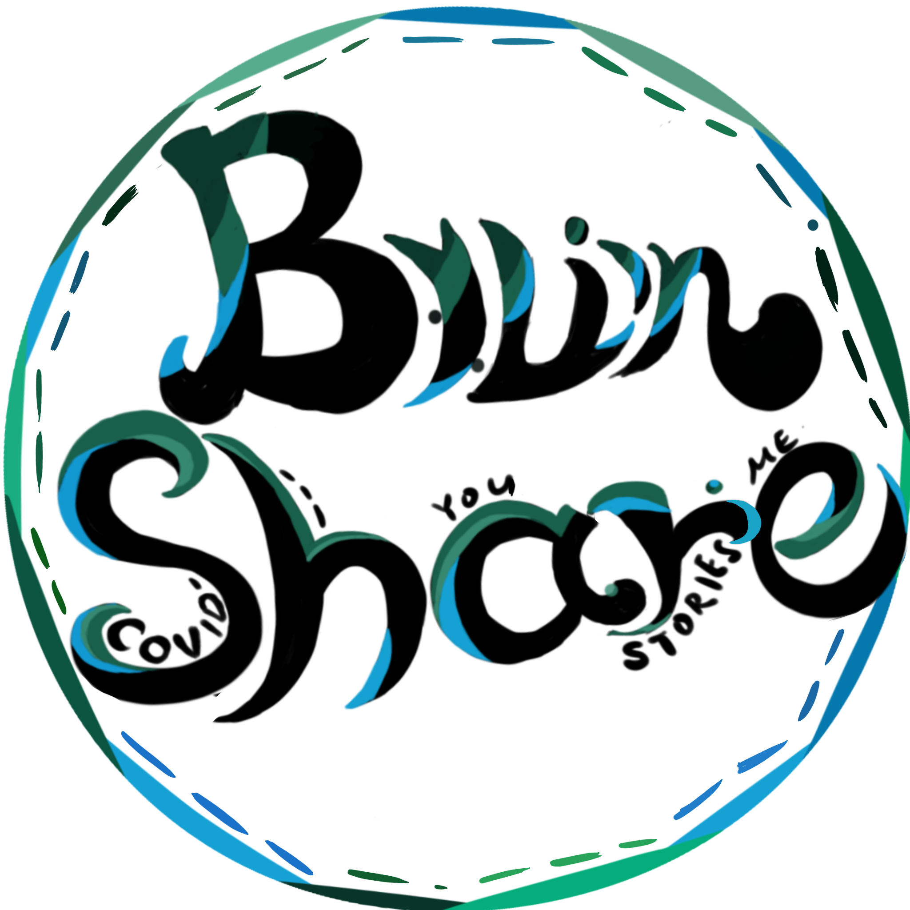
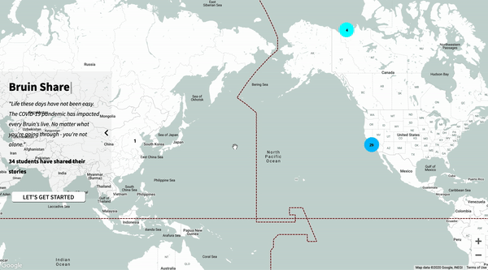
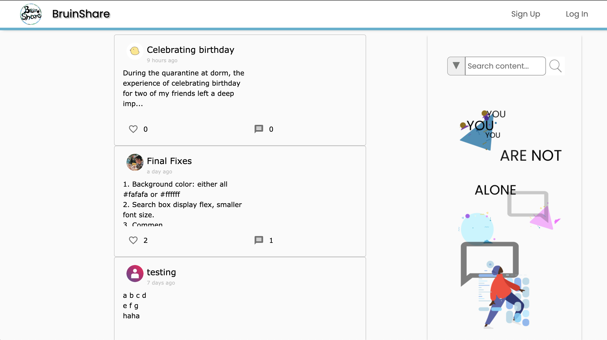
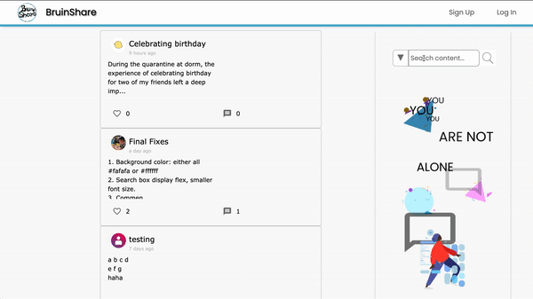
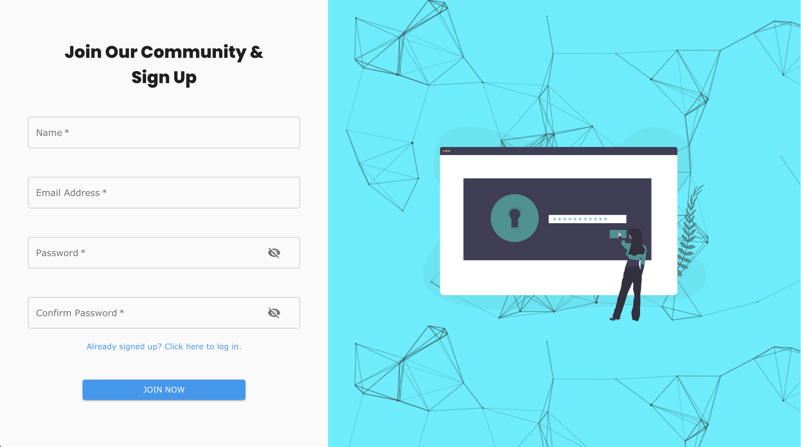
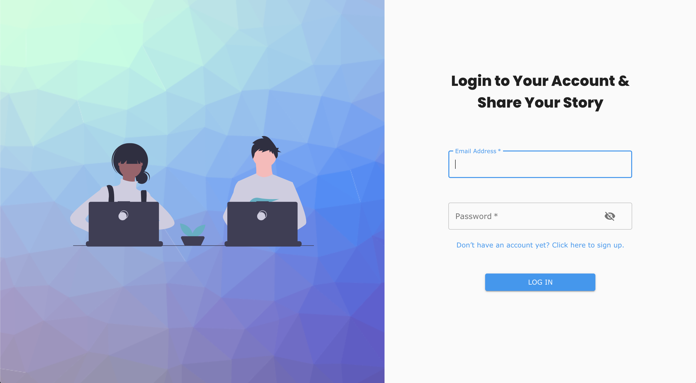
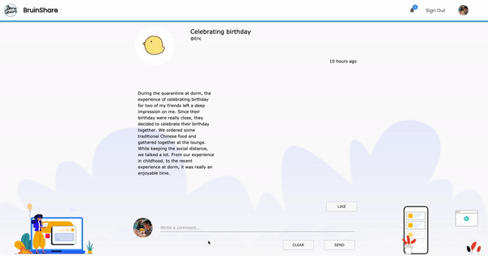
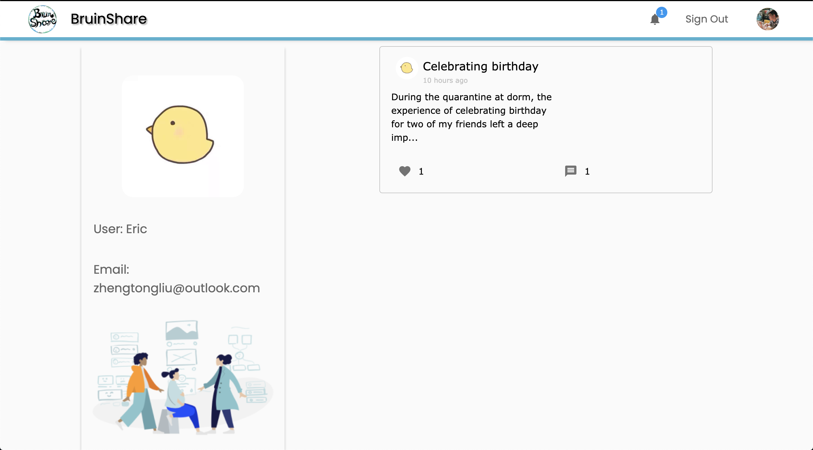
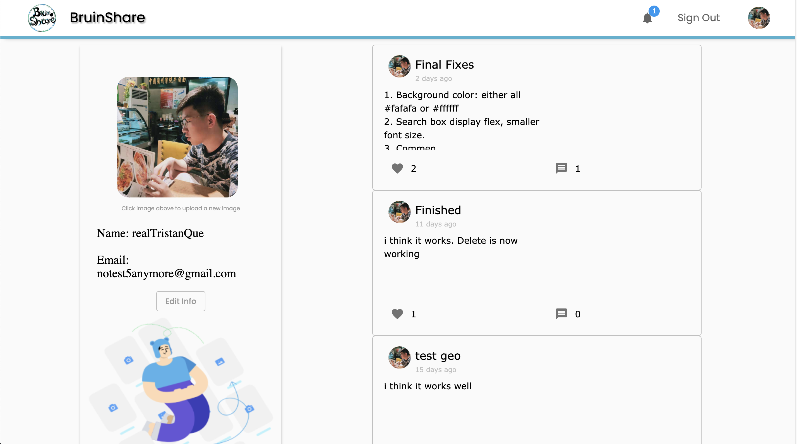
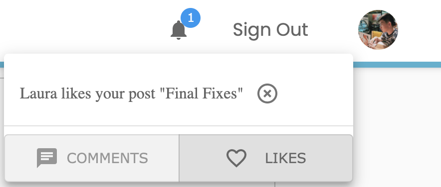

# Bruin Share



## Deployed Demo

https://bruin-share.netlify.app/


> This is just the frontend repo, you can also check out our backend development repo(deployed): https://github.com/donghangwu/Bruin-Share-Backend


## Quick Start

1. Clone this repo

```
git clone https://github.com/Tristan816la/Bruin-Share-Frontend.git
cd Bruin-Share-Frontend
```
2. Install all the dependencies

```
npm install
```
3. Run this project

```
npm start
```


## Purpose

- Life under covid-19 hasn't been easy for everyone. With everything happening overtime, Bruins might find it difficult to share their stroies during these special days of qurantine. Everything looks nice and intact on Facebook and Instagram Stories, but it is hard to find a platform to share Bruins' unkown stories.

- Bruin Share is dedicated to be a safe place for sharing covid stories. Built as an online platform specific for Bruins, Bruin Share encourages every Bruin to share their stories to their fellow schoolmates and alumni. Bruins can share posts, react to posts, get to know the Bruins around the world by using Bruin Share.


## Features

- **Automatic Location Display:** No matter where you are, you can always find fellow bruins who live near you and read their story

  


- **Minimalistic Forums:** Tired of Facebook and Reddit's forums with arbitrary ads and random tools you never used, we kept our app very simple with all necessary features

  


- **Search the story you like:** Smart search based on topics and contents, find the post you've never forgot

  


- **Join Us in two steps:** Quick login and Sign up with info verification

  <p float="left">
    
    
  </p>

- **Endorse your peer and let them hear you**: Give quick comments and likes on posts you like

  


- **Get to Know your peers**: Each user has a profile page and a customizable private page

<p float="left">
  
  
</p>

- **We helped you keep track of what you might miss:** Notification reminds you of unread likes and comments




## Tech Stack

**Frontend**

- React / React Hooks
- Google Map Api
- Styled Components 
- Material UI core / icons
- Moment.js
- Axios
- Netlify (Deployment)


**Backend**

- MongoDB Atalas
- Express
- Node.js
- Cloudinary
- JWT & Bcrypt
- Heroku (Deployment)


**UI**

- Figma
